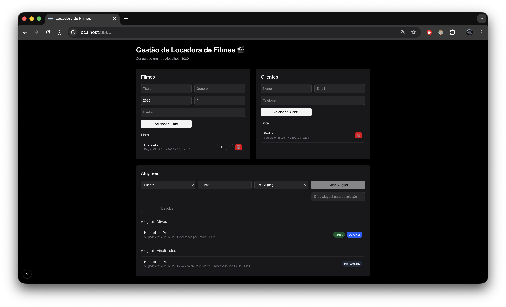

# Gestão de Locadora de Filmes

## Sobre o Projeto

Este é um projeto de gestão de locadora de filmes desenvolvido com Next.js. O objetivo é fornecer uma interface web para gerenciar filmes, clientes e aluguéis
com backend em Java e Spring Boot disponivel em https://github.com/PedroSmaxY/filmes-crud.

## Funcionalidades

- Gerenciamento de filmes
- Gerenciamento de clientes
- Gerenciamento de aluguéis

## Tecnologias Utilizadas

- Next.js
- Tailwind CSS
- React
- React Hot Toast
- Zod

## Como Executar

1. Clone e entre no repositório

```bash
git clone https://github.com/PedroSmaxY/filmes-website.git
cd filmes-website
```

2. Instale as dependências

```bash
npm install
```

3. Execute o projeto

```bash
npm run dev
```

4. Screenshot do projeto funcionando


